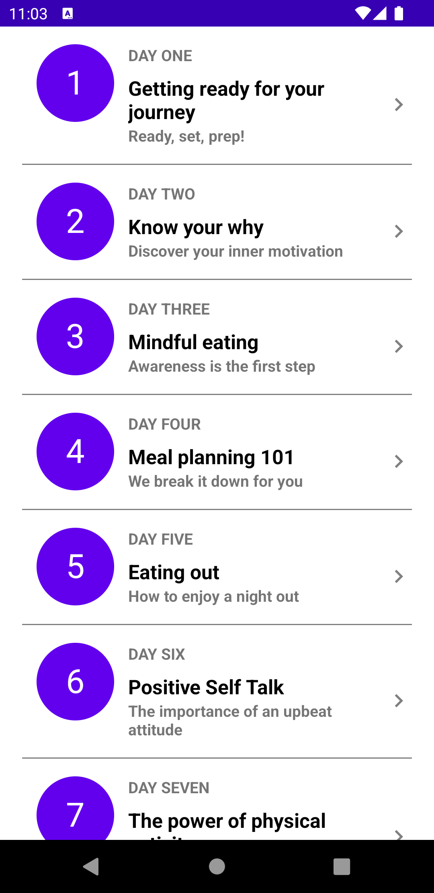
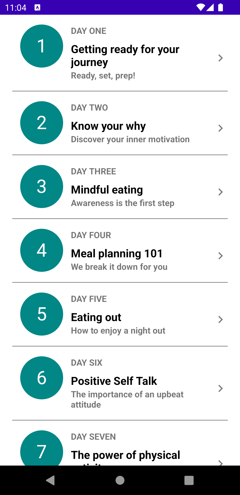
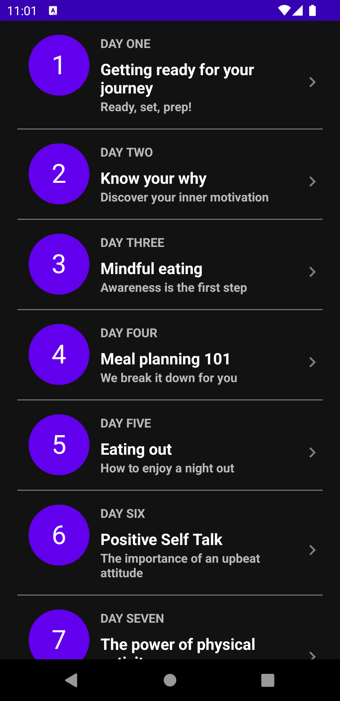
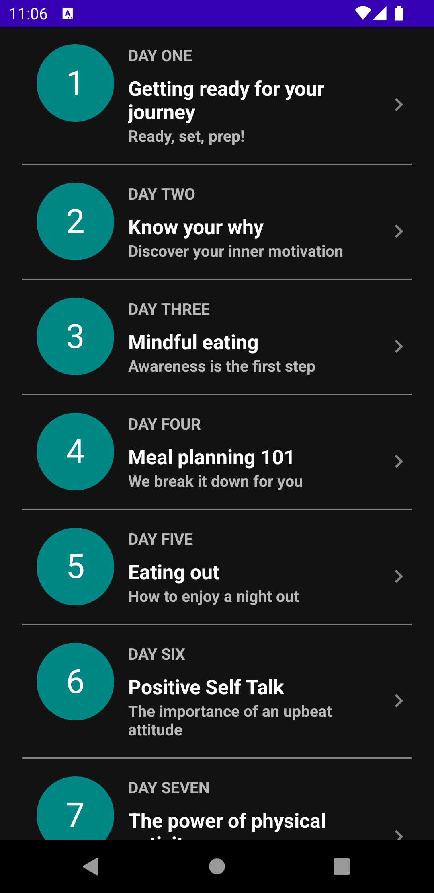

# Journey App &middot; 

Android application that shows journeys

  
  
  
  

## Project characteristics

This project takes advantage of best practices, many popular libraries and tools in the Android
ecosystem.

* Components
    * [100% Kotlin](https://kotlinlang.org/)
      with [Coroutines](https://kotlinlang.org/docs/reference/coroutines-overview.html) - perform
      background operations
    * [Jetpack](https://developer.android.com/jetpack)
        * [Lifecycle](https://developer.android.com/topic/libraries/architecture/lifecycle) -
          perform an action when lifecycle state changes
        * [ViewModel](https://developer.android.com/topic/libraries/architecture/viewmodel) - store
          and manage UI-related data in a lifecycle conscious way
    * [Hilt](https://dagger.dev/hilt) - dependency injection
    * [Gson](https://github.com/google/gson) - convert a JSON string to an equivalent Java object
* Architecture
    * MVVM + Clean Architecture
    * [Android Architecture components](https://developer.android.com/topic/architecture)
    * [Android KTX](https://developer.android.com/kotlin/ktx) - Jetpack Kotlin extensions
* CI
    * [GitHub Actions](https://github.com/features/actions) - automatic PR verification including
      tests, linters and app assemble
* Testing
    * [JUnit 5](https://junit.org/junit5/) - unit tests
    * [Hilt Test](https://dagger.dev/hilt/testing) - instrumented tests
    * [Mockk](https://mockk.io/) - mocking framework
* UI
    * [Material design](https://material.io/design)
    * [Recycler](https://developer.android.com/guide/topics/ui/layout/recyclerview)
    * Reactive UI
    * Dark Mode support
* Static analysis tools
    * [Detekt](https://github.com/arturbosch/detekt#with-gradle) - verify complexity look for and
      code smell
* Gradle
    * [Gradle Kotlin DSL](https://docs.gradle.org/current/userguide/kotlin_dsl.html)
    * Plugins ([android-junit5](https://github.com/mannodermaus/android-junit5)
      , [Dependency Update](https://github.com/ben-manes/gradle-versions-plugin))
    * [Versions catalog](https://docs.gradle.org/7.0-milestone-1/userguide/platforms.html)
    * Configured flavours `free` and `pro`
    